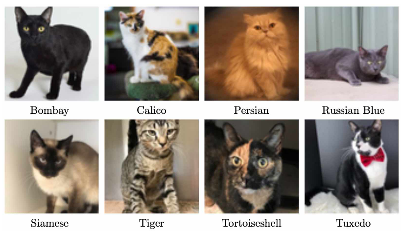

# Cat Image Classification – Neural Network Project

## Project Summary
This project aims to develop a highly accurate neural network model to classify 8,000 images of cats into their respective categories. 

By leveraging state-of-the-art pre-trained convolutional neural networks (CNNs) and systematic experimentation, the final model achieves robust performance on both training and test datasets.

---

## What's in This Repo
- **`model.py`** – Main model definition and image transforms using a pre-trained RegNet_Y_800MF CNN for cat image classification
- **`a3main.py`** – Training and evaluation script (provided as part of the assignment; not modified, as the project focus was on the final model)
- **`Designing & Training Neural Networks - Image Classification.pdf`** – Detailed project report documenting the methodology, experiments, and results
- **`README.md`** – Project documentation and summary

---

## Process Overview
The workflow followed a structured, experimental approach:

1. **Model Selection**
   - Evaluated several pre-trained PyTorch models for image classification, including:
     - MobileNet_V3_Large
     - EfficientNet_B0 & B3
     - MNASNet1_3
     - RegNet_Y_800MF
     - ShuffleNet_V2_X2_0
   - Models were chosen based on reported ImageNet-1k accuracy and model size constraints (final model <50MB).

2. **Initial Design & Parameter Choices**
   - Used AdamW as the initial optimiser for its generalisation and popularity in state-of-the-art models.
   - Set initial learning rate to 0.0001, weight decay to 0.01, and experimented with batch sizes (64, 128, 200) and epochs (10, 20, 30).
   - Employed cross-entropy loss for classification.

3. **Data Preparation**
   - Images were resized to model-specific input dimensions (224x224 or 300x300).
   - Normalisation applied using the actual dataset’s mean and standard deviation ([0.4806, 0.4338, 0.3918] and [0.2422, 0.2343, 0.2270]), which improved model performance.
   - Training/validation split of 0.8 provided the best generalisation.

4. **Experimentation & Fine-Tuning**
   - Compared performance across models and hyperparameters.
   - Introduced a CosineAnnealingLR learning rate scheduler for smoother convergence.
   - Conducted further experiments with weight decay, optimiser choice (AdamW vs SGD), learning rate, and validation split.

5. **Final Model Selection**
   - RegNet_Y_800MF (pre-trained on ImageNet) was selected for its superior accuracy and efficiency.
   - Final hyperparameters:
     - Batch size: 64
     - Epochs: 20
     - Weight decay: 0.01
     - Learning rate: 0.0001
     - Optimiser: AdamW
     - Scheduler: CosineAnnealingLR
     - Training/validation split: 0.8

---

## Technologies Used
- **Framework:** PyTorch (torchvision models)
- **Models:** Pre-trained CNNs (see above)
- **Optimisers:** AdamW (primary), SGD (for comparison)
- **Learning Rate Scheduler:** CosineAnnealingLR
- **Loss Function:** Cross-entropy
- **Data Processing:** Image resizing, normalisation

---

## Results
- **Final Model:** RegNet_Y_800MF (fine-tuned)
- **Training Accuracy:** 100%
- **Test Accuracy:** 93.88%
- **Dataset:** 8,000 labelled cat images
